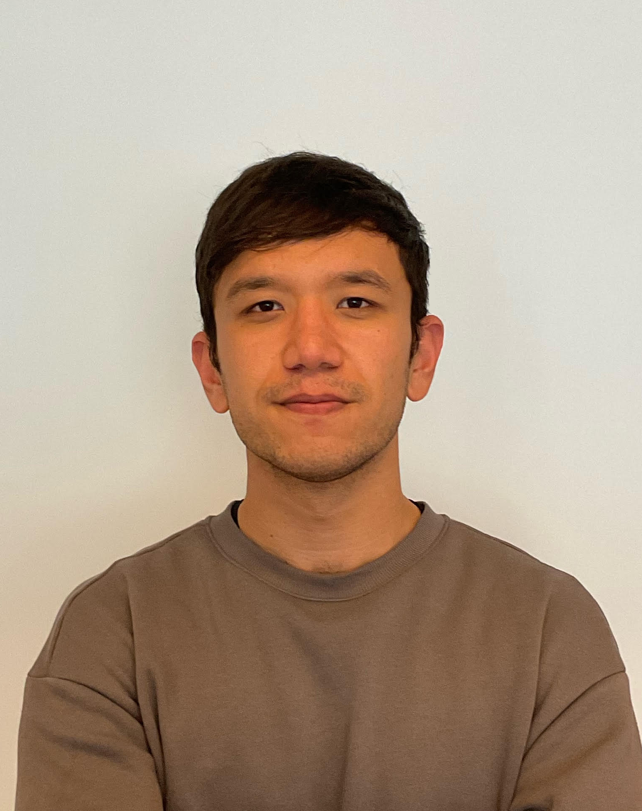

##  About Me

I am currently an **BEng. student** at [Polytechnic of Turin]([https://epfl.ch](https://www.polito.it/)) in Computer Engineering and a **Research Student Assistant** at [LiGHT lab]([https://www.yale-light.org/]) supervised by prof. [Mary-Anne Hartley]([https://medicine.yale.edu/profile/mary-anne-hartley/]). 

  
  
  

---

##  Education

1. **Visiting Student**. EPFL. Lausanne, Switzerland. Aug. 2024 - Present
2. **AI Summer School Participant**. Texas A&M @Qatar. Doha, Qatar. May. 2024 - June. 2024
3. **Bachelor's in Computer Engineering**. Politecnico di Torino. Turin, Italy. Oct. 2022 - Present

---

##  Experience

1. **Research Intern**. [LiGHT lab](https://www.yale-light.org/). Yale & EPFL, Switzerland. Jun. 2024 - Present.   
2. **Research Assistant**. [Fabris Lab](https://www.epfl.ch/labs/dhlab/). PoliTO, Italy. Sep. 2023 - Jul. 2024.   
3. **SAT & Math teacher - promoted - Head of Research and Development**. [Sodiq Academy](https://sodiqacademy.uz/). Tashkent, Uzbekistan. Aug. 2019 - Sep. 2022.

--- 

##  Projects
1. **[Antibiogo-IHZ](https://github.com/aleph17/Antibiogo--IHZ)**. Tool to assist in antimicrobial resistance testing for low-resource settings.   #DeepLearning #Healthcare #AI

2. **[AMAP](https://github.com/aleph17/AMAP)**. Package to automatically measure nanoparticle dimensions based on TEM images.   #Nanotechnology #ImageProcessing #MachineLearning

3. **[ML-Knowledge Distillation](https://github.com/aleph17/ML-KnowledgeDistillation)**. Implementation of knowledge transfer between deep learning models.   #DeepLearning #KnowledgeDistillation #AI

4. **[Argifts](https://github.com/aleph17/Argifts-Data-Analysis)**. Data analysis on e-transactions to derive insights for business operations.   #DataAnalysis #ECommerce #BusinessInsights

5. **[Uzum](https://github.com/aleph17/Uzum)**. Recommendation system prototype for e-commerce platforms using collaborative filtering.   #RecommendationSystem #CollaborativeFiltering #ECommerce

---

##  Independent Learning
1. **[Deep Learning for Computer Vision](https://github.com/aleph17/cs231n)**. Stanford Online

2. **[Machine Learning](https://coursera.org/verify/specialization/EQK94P2236NR)**. Stanford Online

3. **[Data Science](https://drive.google.com/drive/folders/1GaDuIVe9gUTxDT-hVQuBrO8uhJqlO5_H?usp=drive_link)**. Kaggle

4. **[Applied Probability](https://drive.google.com/file/d/13lU3xfmI12Z88l9tEWb4w-F8dSRaVrkd/view?usp=sharing%20-)**. MIT OpenCourseWare

5. **[Linear Algebra](https://drive.google.com/file/d/1Ibgi8zKDHEeeuuIBBeV1oObm8PBLoPdq/view?usp=sharing)**. MIT OpenCourseWare

6. **[Entrepreneurship](https://coursera.org/verify/specialization/75F3XIG0IMUF)**. University of Pennsylvania

7. **[Intro to Quantum Computing](https://drive.google.com/file/d/1XlsxQS0pzdEUZvcIVNEF4eA2m0XKp4Ij/view?usp=sharing)**. Google Quantum AI & QxQ

---

##  External Activities
1. **[Educational Advisor](https://t.me/StudentHelpItaly)**. Volunteer at StudentHelp for Central Asian students transitioning to European universities.

2. **[Self-made philosopher](https://t.me/inshorter)**. Love reading thought-intensive books and keep a blog for my thoughts.

3. **Language learner**. English (C2 [IELTS 8.0](https://drive.google.com/file/d/187g0toTuzfwWyZoiEZ4tScRzL2aY58Nq/view?usp=sharing)), Russian (C1+), Italian (B1). Currently learning Turkish (A1) and Arabic (A1).

4. **Sports enthusiast**. Gym, running, ping pong.

---

##  News
<table>
  <tr>
    <td>Sep. 2024</td>
    <td><a href="https://deepfake-minihackaton.my.canva.site/">Participated</a> in <a href="https://memento.epfl.ch/event/deepfake-mini-hackathon/">DeepFake Hackaton</a></td>
  </tr>
  <tr>
    <td>Jun. 2024</td>
    <td>Started Summer Research Internship in <a href="https://nlp.epfl.ch">NLP Lab</a> on Multilingual Model Training project by <a href="https://www.swiss-ai.org">Swiss AI Initiative</a></td>
  </tr>
  <tr>
    <td>May. 2024</td>
    <td>Presented my LLM Agents project in <a href="https://www.epfl.ch/labs/dhlab/">DHLAB</a></td>
  </tr>
  <tr>
    <td>Apr. 2024</td>
    <td><a href="https://github.com/Jakhongir0103/Coding_interview_bot">Participated</a> in <a href="https://www.linkedin.com/posts/lauzhack_hackathon-llms-genai-activity-7189548347953750016-CaxD/">LLM Hackathon</a></td>
  </tr>
  <tr>
    <td>Apr. 2024</td>
    <td>Presented my text-to-SQL project in <a href="https://www.epfl.ch/labs/dhlab/">DHLAB</a></td>
  </tr>
  <tr>
    <td>Mar. 2024</td>
    <td><a href="https://drive.google.com/drive/folders/1teC1REyTPTpRIVsZiywHxBddBd7KoKE0">Participated</a> in <a href="https://2024.appliedmldays.org">AMLD 2024</a></td>
  </tr>
  <tr>
    <td>Feb. 2024</td>
    <td>Started Student Research Assistantship in <a href="https://www.epfl.ch/labs/dhlab/">DHLAB</a> on LLM QA system project by <a href="https://www.epfl.ch/research/domains/venice-time-machine/">Venice Time Machine</a></td>
  </tr>
</table>
