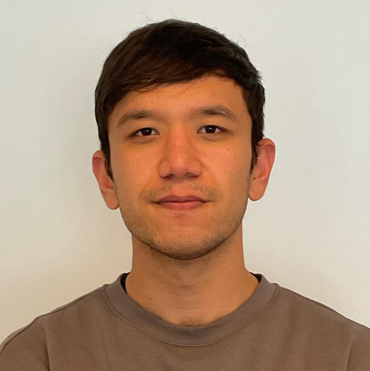

##  About Me

I am currently a **MSc. student** at [ETH Zurich]([https://ethz.ch](https://www.polito.it/)) in Machine Intelligence and a **Research Student Assistant** at [ETH AI Center]([https://www.ai.ethz.ch/]) supervised by [Imano Schlag]([https://ischlag.github.io/]). 

  
  
  

---

##  Education

1. **Master's in Computer Science**. ETHZ. Zurich, Switzerland Sep. 2025 - Present
2. **Visiting Student**. EPFL. Lausanne, Switzerland. Aug. 2024 - Dec. 2024
3. **AI Summer School Participant**. Texas A&M @Qatar. Doha, Qatar. May. 2024 - June. 2024
4. **Bachelor's in Computer Engineering**. Politecnico di Torino. Turin, Italy. Oct. 2022 - Jul. 2025

---
##  Experience

1. **Research Assistant**. [ETH AI Center](https://ai.ethz.ch/). Zurich, Switzerland. Jul 2025 – Current.   
2. **Research Intern**. [LiGHT Lab](https://www.light-laboratory.org/). Yale & EPFL. Aug 2024 – Dec 2024.   
3. **Research Assistant**. [Fabris Lab](https://fabrislab.com/). Polytechnic of Turin. Sep 2023 – Jul 2024.

--- 

##  Projects
1. **[antibiogo](https://github.com/aleph17/antibiogo)**. Tool to assist in antimicrobial resistance testing for low-resource settings.  
2. **[reval](https://github.com/aleph17/reasoning-eval-apertus)**. Light-weight reasoning evaluation pipeline for Apertus training.  
3. **[FP8](https://github.com/aleph17/ao)**. Stochastic rounding implementation for FP8 in torchao.  
4. **[verl_tooling](https://github.com/aleph17/verl)**. RL training pipeline for Apertus vision tooling.  
5. **[course_projects](https://github.com/aleph17?tab=repositories)**. Course projects for bachelor and master courses taken.  

--

##  Independent Learning
1. **[Machine Learning](https://coursera.org/verify/specialization/EQK94P2236NR)**. Stanford Online

2. **[Data Science](https://drive.google.com/drive/folders/1GaDuIVe9gUTxDT-hVQuBrO8uhJqlO5_H?usp=drive_link)**. Kaggle

3. **[Applied Probability](https://drive.google.com/file/d/13lU3xfmI12Z88l9tEWb4w-F8dSRaVrkd/view?usp=sharing%20-)**. MIT OpenCourseWare

4. **[Linear Algebra](https://drive.google.com/file/d/1Ibgi8zKDHEeeuuIBBeV1oObm8PBLoPdq/view?usp=sharing)**. MIT OpenCourseWare

5. **[Entrepreneurship](https://coursera.org/verify/specialization/75F3XIG0IMUF)**. University of Pennsylvania

6. **[Intro to Quantum Computing](https://drive.google.com/file/d/1XlsxQS0pzdEUZvcIVNEF4eA2m0XKp4Ij/view?usp=sharing)**. Google Quantum AI & QxQ

---

##  External Activities
1. **Educational Advisor**. Volunteer at [StudentHelp](https://t.me/StudentHelpItaly) for Central Asian students transitioning to European universities.

2. **Self-made philosopher**. Love reading thought-intensive books and keep a [blog](https://t.me/inshorter) for my thoughts.

3. **Language learner**. English (C2 [IELTS 8.0](https://drive.google.com/file/d/187g0toTuzfwWyZoiEZ4tScRzL2aY58Nq/view?usp=sharing)), Russian (C1+), Italian (B1). Currently learning Turkish (A1) and Arabic (A1).

4. **Sports enthusiast**. Gym, running, ping pong.

---

##  News
<table>
  <tr>
    <td>Oct. 2025</td>
    <td>First mention in a research paper - Apertus.</td>
  </tr>
  <tr>
    <td>Sep. 2025</td>
    <td>Started Master's degree at ETH Zurich.</td>
  </tr>
  <tr>
    <td>Aug. 2025</td>
    <td>Started RAship at ETH AI Center.</td>
  </tr>
  <tr>
    <td>Jul. 2025</td>
    <td>Graduated from Politecnico di Torino.</td>
  </tr>
  <tr>
    <td>Nov. 2024</td>
    <td>Participated in Meta's GenAI conference.</td>
  </tr>
  <tr>
    <td>Oct. 2024</td>
    <td>Participated in Data Challenge.</td>
  </tr>
  <tr>
    <td>Aug. 2024</td>
    <td>Joined the LiGHT lab.</td>
  </tr>
  <tr>
    <td>May. 2024</td>
    <td>Participated in AI Summer School.</td>
  </tr>
  <tr>
    <td>Apr. 2024</td>
    <td>Participated in ETH Quantum Hackathon.</td>
  </tr>
  <tr>
    <td>Mar. 2024</td>
    <td>Participated in AMLD 2024.</td>
  </tr>
  <tr>
    <td>Nov. 2023</td>
    <td>Participated in Quantum Oracles hackathon.</td>
  </tr>
</table>
